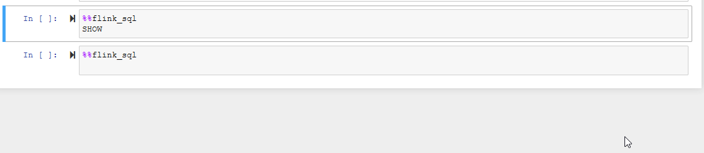

# vvp-magics

[](https://travis-ci.com/dataArtisans/vvp-jupyter)

Experimental support for vvp using IPython Magics commands.

## Packaging

This can be done with
```
python3 setup.py sdist
```
in the same folder as `setup.py`.

The package can be installed locally with 
```
pip3 install ./dist/vvpmagics-x.y.z.tar.gz
```

The package also contains a custom kernel that extends the IPython kernel to provide SQL code completion.
To install the kernel run `jupyter kernelspec install --user flinksqlkernel` after building the package.

## Docker setup

1. Build the vvp-magics package (same as above):
```
python3 setup.py sdist
```
2. Then create the Docker image:
```
docker build . --tag vvp-jupyter:latest
```
This image can be run independently and used to connect to any running VVP instance.
The Docker image comes with the FlinkSql Kernel for code completion pre-installed.

### Docker-compose with VVP
Run docker compose to set the full vvp environment up:
```
docker-compose up vvp-gateway vvp-appmanager vvp-ui vvp-jupyter
```

To log into Jupyter, look into the docker compose output and find a line that looks like this:
```
http://127.0.0.1:8888/?token=814a4f1ef6a10328f25e67aeb9e5d67e381aff0b2fc7ad2b
```

In the notebook use `vvp-gateway` as hostname and `8080` as port.
An example notebook can be found in the `work` folder.


## Loading the extension

From within IPython (`ipython3`) or an IPython3 kernel in a local Jupyter instance,
run
```
%load_ext vvpmagics
```
to load the extension and register the magics.

## Sessions

A *session* corresponds to a connection to a VVP instance,
specifying its hostname and port,
and an API key if required.
The session has a name for convenient reference.

From within IPython (`ipython3`) or an IPython3 kernel in a Jupyter instance,
run
```
%connect_vvp localhost -p 8080 -n default -s mysession
```
This will connect and create a session with the name `mysession`.
The VVP host in this example is `localhost` and the port is `8080`.
The hostname should be the name under which VVP is accessible from the Jupyter server.
If no session exists then this session will be set as the default.

Session names are treated by the magics as strings.
The corresponding session object, with that name,
is found and taken from the local user context.

Session names can be listed by executing
```python
from vvpmagics import VvpSession
VvpSession.get_sessions()
```

### Using API Keys

- The argument `-k <API-Key>` (or `--key <API-Key>`) 
  will use the given value in `<API-Key>` as the API Key.
- To avoid having keys in notebooks, 
  the argument `-K` or `--prompt_key` can be specified,
  which asks the user to enter the key,
  and overrides any value specified by `-k`.

If no keys are specified, no API keys are used.

#### Examples:
```
%connect_vvp HOSTNAME -n default -s mySession -k 10504c2d-55f0-4969-ba83-26fad5f1640f
%connect_vvp HOSTNAME -n default -s mySession -K
```

## SQL requests
Example:
```
%%flink_sql 
   ...: CREATE TABLE `testTable2` ( 
   ...:   id bigint 
   ...:   -- Watermark definition, here for a timestamp column 'ts' 
   ...:   -- WATERMARK FOR ts AS ts - INTERVAL '1' MINUTE 
   ...: ) 
   ...: -- Free text comment 
   ...: COMMENT '' 
   ...: WITH ( 
   ...:   -- Kafka connector configuration. See documentation for all configuration options. 
   ...:     'connector.type' = 'kafka', 
   ...:     'connector.version' = 'universal', 
   ...:     'connector.topic' = 'testTopic', 
   ...:     'connector.properties.bootstrap.servers' = 'localhost:9092', 
   ...:     'connector.properties.group.id' = '...', 
   ...:     'connector.startup-mode' = 'earliest-offset' 
   ...: ) 

```

This will return the HTTP response body from the back end.
If there is a `resultsTable` object then this will be returned as a Pandas Dataframe.

A session can be specified in the first line thus:

```
%%flinksql mySession
...
```

## Substituting user variables

User variables defined in the notebook can be referenced in `flink_sql` cells.
To reference the variable, surround it with braces.
For example, setting

```python
topic_name = "myTopic"
```

allows the user (as in the example above) to do

```
%%flink_sql 

    .....

   ...: WITH ( 
   ...:     'connector.topic' = '{topic_name}', 

    .....

   ...: ) 
```

The cell is treated as a string,
and variables are replaced using Python's `string.format()` method,
so in principle all variables
that have a reasonable representation as a string can be used.
The scope is the `user_ns` dictionary,
accessed by Python via the IPython shell object.

Take care to avoid nesting braced expressions,
but note that double-brace placeholders may also be used (see below).


## Setting deployment parameters
Deployments of SQL INSERT jobs can be customised by setting parameters.
The possible settings keys are listed in a parameters dictionary in the example notebook,
and its use is shown there.
To use these parameters, the switch `-p [parameters-variable-name]` is used in the `flink_sql` Magic.
If no switch is specified, the default variable `vvp_default_parameters` is used.

### Possible deployment setting values
Users may find the following documentation generally useful:
- [Deployment Template settings](https://docs.ververica.com/user_guide/deployments/deployment_templates.html)
- [Lifecycle Management settings](https://docs.ververica.com/user_guide/lifecycle_management/index.html)

Some relevant examples include:

| Setting                               | Possible values                                               | Comment         | Documentation      |
|---------------------------------------|---------------------------------------------------------------|-----------------|--------------------|
|`metadata.name`                        | Arbitrary string                                              | If not specified, then this will be the cell contents. | |
|`metadata.annotations.license/testing` | Boolean: `True` or `False`                                    | The `flink_sql` magic will set this to `False` if not specified. | |
|`spec.template.spec.parallelism`       | Integer                                                       | | [Link](https://docs.ververica.com/user_guide/deployments/deployment_templates.html#parallelism-number-of-taskmanagers-and-slots) |
|`spec.restoreStrategy`                 | String: `"LATEST_STATE"`, `"LATEST_SAVEPOINT"`, or `"NONE"`.  | | [Link](https://docs.ververica.com/user_guide/lifecycle_management/index.html#restore-strategy) |
|`spec.upgradeStrategy`                 | String: `"STATELESS"`, `"STATEFUL"`, or `"NONE"`.             | | [Link](https://docs.ververica.com/user_guide/lifecycle_management/index.html#upgrade-strategy) |

### Flink settings
In the deployment settings,
keys of the form 
```
spec.template.spec.flinkConfiguration.<FlinkConfigurationKey>
```
can be used.
The user can specify Flink configuration parameters in place of `<FlinkConfigurationKey>`.
For example, 
```
"spec.template.spec.flinkConfiguration.state.savepoints.dir": "s3://flink/savepoints"
```
See [here](https://docs.ververica.com/user_guide/deployments/configure_flink.html)
for deployment configuration documentation.

Note that the placeholders (e.g., `{{Namespace}}`) appearing in `flinkConfiguration` settings
are left untouched by `%%flink_sql`, so can be used as normal;
e.g.:
```
"spec.template.spec.flinkConfiguration.state.savepoints.dir": "s3://flink/savepoints/{{ namespace }}"
```
See [here](https://docs.ververica.com/administration/deployment_defaults.html#placeholders-in-flink-configuration)
for further details on placeholders.


## Further examples

See the example notebooks:

- [Connect to VVP](./example_notebooks/ConnectToVVP.test.ipynb)
- [DDL and DML commands and queries](./example_notebooks/FlinkSql.test.ipynb)

## Error messages

Both the `%connect_vvp` and the `%%flink_sql` magics support the `-d/--debug` flag
to show full error messages.
In case of error results from the VVP it will display the full JSON response.  

## Code completion

When using the FlinkSql kernel, SQL queries in a `%%flink_sql` cell will be completed with suggestions from VVP.
In order for code completion to work, a connect_vvp session needs to exist. 
The default session will be used to communicate with VVP unless the another session is set for the `%%flink_sql` cell.
If any problems occur in the communication with VVP, code completion will attempt to use the standard Jupyter completion.




## Help
```
%connect_vvp?
```
and
```
%%flink_sql?
```
will show help texts for the magics.
